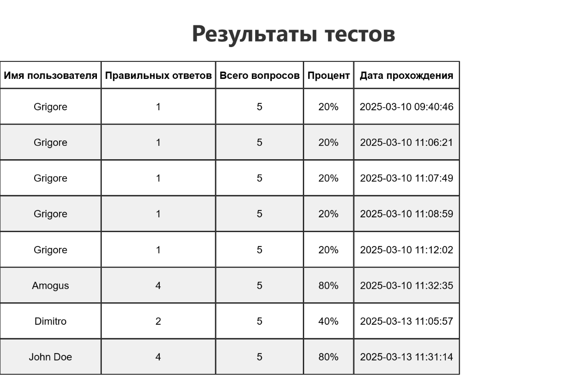

# Альтернативная первая аттестационная работа по PHP
USM 2025 • I2302 • Zaica Grigore

## Инструкции по запуску проекта.
1. Установите [XAMPP](https://www.apachefriends.org/download.html).
2. Перейдите по директории установки, например `C:\xampp`.
    1. Перейдите в папку `C:\xampp\htdocs`.
    2. Создайте в `htdocs` папку с удобным названием, например, `alt_att_test`.
    3. Скачайте репозиторий в виде архива и распакуйте в эту папку.
6. Запустите локальный сервер, используя XAMPP, и перейдя по адресу в браузере `localhost/alt_att_test/` *(или ваше название папки)*.

## Краткое описание функционала приложения.
### Создание и прохождение тестов:

Пользователь выбирает тему теста.
- Перед началом теста пользователь обязательно вводит свое имя.
- Вопросы двух типов:
    - Один правильный ответ (radio).
    - Несколько правильных ответов (checkbox).

### После завершения теста отображается:
- Количество правильных ответов.
- Процент набранных баллов.

### Хранение данных:
- Вопросы и ответы храняться в файле `JSON`.
- Результаты тестов: имя пользователя, набранные баллы, дата, общее кол-во ответов и процент правильности сохраняются и доступны по URL `/dashboard.php`.

### Интерфейс:
- Главная страница с кнопкой "Пройти тест" и "Dashboard".
- Страница прохождения теста с вопросами и вариантами ответов.
- Страница с результатами теста после его завершения.
- Страница "админ-панели" (dashboard).

### Безопасность:
- Валидация всех пользовательских данных на стороне сервера.

## Структура базы данных или файла.
- Всё хранится в формате `.json`
    - Вопросы хранятся локально в `questions.json`
    - Ответы хранятся локально в `results.json`

## Дополнительные требования
- В админ-панели имеется возможность сохранить результаты в PDF файл.
- Приложение стилизовано, но без изысканности.

## Скриншоты работы приложения.

.png)
.png)
.png)
.png)
.png)
